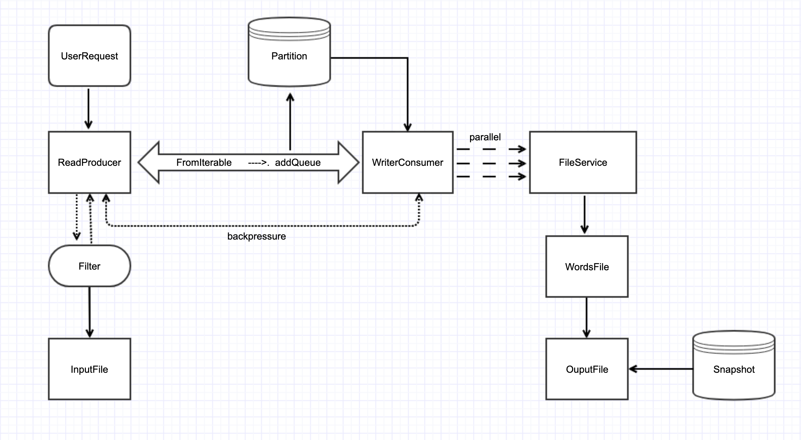

# Producer-Consumer Service

###1. 클래스 설계도

### 2. 프로젝트 설명
1. ReaderProducer 는 사용자 입력을 받아 파일을 읽어 오며 읽어 올때 유효성 체크를 하여 필터링 한 후 스트림 형태로 전송한다.
 - 필터링은 정규식을 (ab!23 (유효함), A12bd (유효함), 123abc (유효함), #abc (유효하지않음)  활용한다). 빈문자나 띄어쓰기도 함께 처리 한다.
2. 전송 중간에 단어를 partition 에 저장하며 저장 조건은 hashcode % partition 으로 계산하여 분할 저장 하도록 한다.
3. WriterConsumer 는 backpressureSize 사이즈가 0보다 크다면 요청 받은 수 만큼 처리 하고 다시 producer 에 요청을 하여 배압을 조절할수 있다.
4. 모든 전송이 완료되면 파티션 키 기준으로 작업을 병렬로 분할한다.
5. FileService 는 분할된 각 파티션 별 데이터를 문자 앞자리 기준으로 그룹핑 하여 리스트를 생성후 OutputFile 로 요청한다.
6. 요청 받은 데이터는 파일로 쓰며 파일명은 단어 앞자리 기준으로 생성된다 각처리마다 해당 데이터는 Snapshot 에 저장후 후에 오는 데이터와 비교하여 중복 저장을 피하도록 한다.
7. 모든 처리가 끝나면 입력받은 파일 경로에서 파일을 확인 할수 있다.

### 3. 주요 고려사항
0. 처리할 파일은 src/main/resources/static/ 밑에 위치 한다. (예: words.txt)
1. producer 와 consumer 는 관계를 느슨하게 한다.
   - Publiher-Subscriber 패턴 활용
2. 데이터는 단계 별로 스트림 처리 하며, 비어있거나 특정문자 띄어쓰기 등을 필터링 처리 한다.
3. producer 는 partition 에 넣기만 하고 consumer 는 소비만 한다.
4. 모든 객체는 불변 하게 처리하며, 동시성을 지원하는 컬렉션및 데이터 타입을 사용하도록 한다.
5. 데이터를 파일에 쓸때 중복 검사는 Snapshot 메모리에 저장후 비교하여 처리한다.
6. producer 에서 받아온 데이터는 단어 앞자리 별로 그룹핑 하여 병렬 처리 하도록 한다.
7. producer 와 consumer 사이에 배앞을 조절하여 발행 속도가 처리 속도를 넘지 못하도록 한다.

### 4. 결과
~~~~
[main] INFO com.coding.kko.Application - a. 처리해야 할 입력 파일명
words.txt
[main] INFO com.coding.kko.Application - b. 결과 파일들을 저장 할 디렉토리 경로
/Users/kimminsuk85/Downloads/kko
[main] INFO com.coding.kko.Application - c. 병렬 처리를 위한 파티션 수 N (1 < N < 28)
8
~~~~

~~~~
...
INFO com.coding.kko.infra.io.OutputWordFile - write file writerFile{fileName='l', words=[lllll]}
INFO com.coding.kko.infra.io.OutputWordFile - write file writerFile{fileName='d', words=[dsadsa, dsadsa, dsadsa]}
INFO com.coding.kko.infra.io.OutputWordFile - write file writerFile{fileName='m', words=[mmnnpnpnp]}
INFO com.coding.kko.infra.io.OutputWordFile - write file writerFile{fileName='z', words=[zzzzzz]}
...
...
~~~~